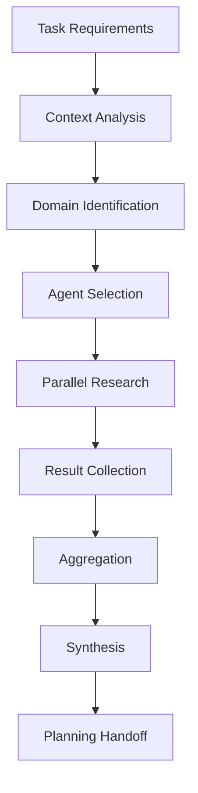

# Research Integration

## Overview

Claude Guild's research capabilities provide **context-aware information gathering** through multiple channels, with intelligent parallelization and result synthesis.

## Research Architecture

```yaml
Research System:
  Core Capabilities:
    - Project analysis (always available)
    - Web search (always available)
    - MCP servers (when configured)
    
  Execution Modes:
    - Sequential: one source at a time
    - Parallel: multiple sources simultaneously
    - Pipeline: continuous research flow
    
  Result Processing:
    - Aggregation: combine findings
    - Deduplication: remove redundancy
    - Synthesis: create insights
```

## Research Agents

### Project Research Agent

```yaml
Agent: guild-project-researcher
Purpose: Internal codebase analysis
Process: research-project-context

Capabilities:
  Pattern Recognition:
    - Code conventions
    - Architecture patterns
    - Testing strategies
    - Error handling patterns
    
  Dependency Analysis:
    - Package dependencies
    - Import relationships
    - Module coupling
    - API usage
    
  Historical Analysis:
    - Git history
    - Change patterns
    - Bug locations
    - Refactoring history

Context Selection:
  - Focus areas based on task
  - Depth based on complexity
  - Scope based on impact
```

### Global Research Agent

```yaml
Agent: guild-global-researcher
Purpose: External knowledge gathering
Process: research-best-practices

Capabilities:
  Documentation Research:
    - Official docs
    - API references
    - Migration guides
    - Security advisories
    
  Community Research:
    - Stack Overflow patterns
    - GitHub examples
    - Blog posts
    - Conference talks
    
  Standards Research:
    - Industry standards
    - Best practices
    - Design patterns
    - Anti-patterns

Context Selection:
  - Technology-specific research
  - Problem-domain research
  - Solution-pattern research
```

## MCP Server Integration

### Optional Enhancement

```yaml
MCP Integration:
  Detection:
    Check: Available MCP servers
    Identify: Server capabilities
    Map: To research needs
    
  Usage Patterns:
    Documentation Access:
      - Framework docs
      - Library references
      - API specifications
      
    Code Examples:
      - Implementation patterns
      - Usage examples
      - Test patterns
      
    Version Information:
      - Compatibility
      - Migration paths
      - Deprecations

  Fallback Strategy:
    If no MCP servers:
      - Use web search
      - Analyze local code
      - Apply heuristics
```

### MCP Configuration

```yaml
# .guild/instructions.md
research:
  mcp_servers:
    enabled: true
    preferred_servers:
      - context7  # For library docs
      - github    # For code examples
      
    fallback_order:
      1. MCP servers
      2. Web search
      3. Local analysis
      
    timeout: 10s
    cache: true
```

### MCP Research Process

```javascript
// Conceptual MCP research flow
async function researchWithMCP(topic, context) {
  // Check for available MCP servers
  const servers = await detectMCPServers();
  
  if (servers.length > 0) {
    // Use MCP for research
    const mcpResults = await Promise.all(
      servers.map(server => 
        server.research(topic, context)
      )
    );
    return aggregateResults(mcpResults);
  }
  
  // Fallback to other methods
  return fallbackResearch(topic, context);
}
```

## Web Search Integration

### Search Strategy

```yaml
Web Search:
  Primary Uses:
    - Best practices research
    - Problem solutions
    - Community patterns
    - Latest updates
    
  Search Optimization:
    Query Construction:
      - Technology + problem
      - Error message lookup
      - Pattern + framework
      
    Source Prioritization:
      1. Official documentation
      2. Trusted sources (MDN, etc.)
      3. Community resources
      4. Blog posts
      
    Result Filtering:
      - Recency (last 2 years)
      - Relevance scoring
      - Source credibility
```

### Search Process

```yaml
Search Workflow:
  1. Query Generation:
     - Extract key terms
     - Add technology context
     - Include version info
     
  2. Parallel Searches:
     - Documentation search
     - Solution search
     - Example search
     
  3. Result Processing:
     - Extract relevant sections
     - Validate information
     - Cross-reference sources
     
  4. Synthesis:
     - Combine findings
     - Resolve conflicts
     - Create recommendations
```

## Parallel Research Execution

### Parallelization Strategy

```yaml
Parallel Research:
  Trigger Conditions:
    - Complex task (high complexity score)
    - Multiple technologies involved
    - Broad research scope needed
    - Time-sensitive task
    
  Execution Model:
    Parallel Groups:
      Group 1 - Internal:
        - Project patterns
        - Existing solutions
        - Technical debt
        
      Group 2 - External:
        - Best practices
        - Community solutions
        - Security advisories
        
      Group 3 - Specialized:
        - Performance research
        - Security research
        - Accessibility research
```

### Context Selection Mechanism

```yaml
Context Selection:
  Input: Task requirements
  
  Analysis:
    - Identify research domains
    - Determine depth needed
    - Allocate to agents
    
  Distribution:
    Agent 1:
      context: authentication
      focus: security patterns
      
    Agent 2:
      context: performance
      focus: optimization techniques
      
    Agent 3:
      context: testing
      focus: test strategies
      
  Coordination:
    - Prevent overlap
    - Ensure coverage
    - Manage dependencies
```

### Research Aggregation

```yaml
Aggregation Process:
  Collection Phase:
    - Gather all research results
    - Tag with source and context
    - Track confidence levels
    
  Processing Phase:
    - Remove duplicates
    - Resolve conflicts
    - Weight by relevance
    
  Synthesis Phase:
    - Combine insights
    - Create recommendations
    - Prioritize findings
    
  Output Format:
    findings:
      - key_insights: []
      - patterns: []
      - recommendations: []
      - warnings: []
      - examples: []
```

## Research Context Pipeline

### Pipeline Architecture

```yaml
Research Pipeline:
  Stage 1 - Initialization:
    - Parse research requirements
    - Identify research domains
    - Select research agents
    
  Stage 2 - Execution:
    - Launch parallel researchers
    - Monitor progress
    - Handle timeouts
    
  Stage 3 - Aggregation:
    - Collect results
    - Process findings
    - Synthesize insights
    
  Stage 4 - Delivery:
    - Format results
    - Prioritize findings
    - Transfer to planning
```

### Context Flow



## Research Patterns

### Pattern 1: Comprehensive Research

```yaml
Pattern: Comprehensive
When: New feature or complex task
Approach: Maximum parallel research

Execution:
  parallel:
    - Project researcher: full codebase scan
    - Global researcher: extensive best practices
    - MCP researcher: complete documentation
    - Security researcher: vulnerability check
    
Result: Complete knowledge base
```

### Pattern 2: Focused Research

```yaml
Pattern: Focused
When: Specific problem or bug
Approach: Targeted research

Execution:
  sequential:
    - Project: find similar code
    - Global: search error solutions
    - MCP: check known issues
    
Result: Specific solutions
```

### Pattern 3: Incremental Research

```yaml
Pattern: Incremental
When: Iterative development
Approach: Research as needed

Execution:
  on_demand:
    - Start with minimal research
    - Expand based on findings
    - Deep dive when needed
    
Result: Efficient research
```

## Research Configuration

### User Configuration

```yaml
# .guild/instructions.md
research:
  parallel:
    enabled: true
    max_researchers: 3
    timeout: 30s
    
  sources:
    project:
      depth: comprehensive
      include_tests: true
      include_docs: true
      
    web:
      enabled: true
      max_results: 10
      preferred_sites:
        - official docs
        - stackoverflow
        - github
        
    mcp:
      enabled: true
      servers: [context7, github]
      cache_duration: 1h
      
  context_selection:
    automatic: true
    max_contexts: 5
    prioritize: [security, performance]
```

### Research Caching

```yaml
Caching Strategy:
  Cache Levels:
    L1 - Memory:
      - Current session
      - Fast access
      - Auto-expire
      
    L2 - File:
      - Cross-session
      - Persistent
      - Manual clear
      
  Cache Keys:
    - Technology + version
    - Problem + solution
    - Pattern + implementation
    
  Cache Invalidation:
    - Time-based (1 hour default)
    - Version change
    - Manual refresh
```

## Research Quality

### Quality Metrics

```yaml
Research Metrics:
  Coverage:
    - Domains covered
    - Depth achieved
    - Sources consulted
    
  Relevance:
    - Result applicability
    - Solution fitness
    - Pattern matching
    
  Efficiency:
    - Time to results
    - Parallel utilization
    - Cache hit rate
```

### Quality Assurance

```yaml
Quality Checks:
  Source Validation:
    - Check credibility
    - Verify recency
    - Cross-reference
    
  Information Validation:
    - Fact checking
    - Version compatibility
    - Security verification
    
  Result Validation:
    - Completeness check
    - Consistency check
    - Applicability check
```

## Advanced Research Features

### Semantic Research

```yaml
Semantic Analysis:
  Code Understanding:
    - Symbol relationships
    - Data flow analysis
    - Control flow analysis
    
  Pattern Matching:
    - Design patterns
    - Anti-patterns
    - Code smells
    
  Impact Analysis:
    - Change impact
    - Dependency impact
    - Risk assessment
```

### Predictive Research

```yaml
Predictive Features:
  Anticipatory Research:
    - Predict next needs
    - Preload relevant docs
    - Cache likely queries
    
  Trend Analysis:
    - Technology trends
    - Community direction
    - Deprecation warnings
```

## Research Examples

### Example 1: React Hooks Migration

```yaml
Research Execution:
  Project Research:
    - Find class components
    - Analyze state usage
    - Identify lifecycle methods
    
  Global Research:
    - Hooks best practices
    - Migration strategies
    - Common pitfalls
    
  MCP Research:
    - Official React docs
    - Hook API reference
    - Migration guide
    
  Result:
    - Migration plan
    - Risk assessment
    - Implementation strategy
```

### Example 2: Performance Optimization

```yaml
Research Execution:
  Project Research:
    - Performance bottlenecks
    - Database queries
    - Render patterns
    
  Global Research:
    - Optimization techniques
    - Benchmark tools
    - Case studies
    
  Web Research:
    - Latest optimizations
    - Community solutions
    - Tool recommendations
    
  Result:
    - Optimization priorities
    - Implementation plan
    - Measurement strategy
```

## Best Practices

### Research Efficiency

1. **Parallel by Default**: Use parallel research for complex tasks
2. **Context Selection**: Choose specific contexts for focused research
3. **Cache Aggressively**: Reuse research results when possible
4. **Timeout Appropriately**: Set reasonable timeouts for research
5. **Synthesize Early**: Start synthesis as results arrive

### Research Quality

1. **Verify Sources**: Check credibility and recency
2. **Cross-Reference**: Validate findings across sources
3. **Prioritize Official**: Prefer official documentation
4. **Consider Context**: Apply findings to specific project context
5. **Document Findings**: Keep research results for future reference

This comprehensive research integration system provides powerful, flexible information gathering capabilities that enhance Guild's ability to make informed decisions and generate high-quality solutions.