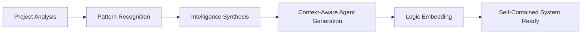

# Claude Guild Architecture

## Design Philosophy

Claude Guild follows these core architectural principles:

### 1. Prompt-First Intelligence
- **All intelligence through prompts**: No hardcoded detection or patterns
- **Claude-native analysis**: Leverage Claude's full understanding capabilities
- **Dynamic adaptation**: Let Claude determine optimal approaches
- **Future-proof design**: New models automatically improve the system

### 2. Simplicity Through Orchestration
- **Thin orchestration layer**: <500 lines of coordination code
- **Prompt library**: All intelligence defined in prompts.md
- **Clear separation**: Orchestration invokes prompts, Claude provides intelligence
- **Minimal configuration**: Sensible defaults, override when needed

### 3. Technology Agnostic Through Intelligence
- **No pattern detection**: Ask Claude to understand projects
- **Universal understanding**: Claude analyzes any technology stack
- **Automatic adaptation**: Claude identifies optimal approaches
- **No hardcoding**: Zero framework-specific implementations

### 4. Performance Through Intelligence
- **Smart analysis**: Claude determines what needs investigation
- **Context optimization**: Claude engineers optimal context packages
- **Adaptive strategies**: Claude adjusts approach based on project
- **Thinking mode allocation**: Claude determines cognitive requirements

### 5. Context Engineering Excellence
- **Prompt-driven optimization**: Claude creates optimal context structures
- **Structured handoffs**: Claude generates XML-tagged packages
- **Progressive detail**: Claude determines detail levels
- **Intelligent compression**: Claude performs relevance filtering

### 6. Cognitive Resource Allocation
- **Dynamic thinking modes**: Claude determines appropriate reasoning level
- **Task-adapted reasoning**: Claude matches complexity to requirements
- **Efficient resource use**: Claude optimizes cognitive load

## Prompt-Driven Architecture

```
┌─────────────────────────────────────────────────┐
│            Prompts (Intelligence)               │
│  - Project analysis prompts                     │
│  - Agent generation prompts                     │
│  - Workflow orchestration prompts               │
│  - Quality assurance prompts                    │
└─────────────────────────────────────────────────┘
                        ↓
┌─────────────────────────────────────────────────┐
│            Commands (Orchestration)             │
│  - Parse input and flags                        │
│  - Invoke appropriate prompts                   │
│  - Coordinate Claude's execution                │
└─────────────────────────────────────────────────┘
                        ↓
┌─────────────────────────────────────────────────┐
│         Claude Analysis (Understanding)         │
│  - Analyze project using full capabilities      │
│  - Understand patterns and architecture         │
│  - Determine optimal approaches                 │
└─────────────────────────────────────────────────┘
                        ↓
┌─────────────────────────────────────────────────┐
│       Dynamic Generation (Adaptation)           │
│  - Generate project-specific agents             │
│  - Create optimized workflows                   │
│  - Configure based on analysis                  │
└─────────────────────────────────────────────────┘
```

### Layer Responsibilities

| Layer | Purpose | Implementation |
|-------|---------|----------------|
| **Prompts** | System intelligence | Prompt library defining all behaviors |
| **Commands** | Orchestration | Simple coordination invoking prompts |
| **Analysis** | Understanding | Claude analyzes using full capabilities |
| **Generation** | Adaptation | Claude generates project-specific system |

## Prompt-Based Generation System

### Intelligence Through Prompts Flow

```yaml
1. NPM Package Installation:
   - User runs: npx claude-guild@latest
   - System loads prompt library
   
2. Claude-Driven Analysis:
   - Invoke project_analysis prompt
   - Claude uses all tools to understand project
   - Claude determines architecture, technologies, patterns
   
3. Intelligent System Generation:
   - Claude generates agents using agent generation prompts
   - Claude creates workflows using orchestration prompts
   - Claude configures system using configuration prompts
   - All intelligence from Claude, not hardcoded logic
```

### Why Prompt-First Generation?

1. **True Intelligence**: Claude understands projects, not pattern matching
2. **Future-Proof**: New Claude models automatically improve everything
3. **Zero Maintenance**: No need to update for new technologies
4. **Maximum Flexibility**: Works with any project Claude can understand
5. **Self-Contained**: Generated systems work independently
6. **Project-Adaptive**: Optimized for actual project needs

## Agent Architecture

### Thin Agent Design

**Design Philosophy**: Agents are metadata-only (<20 lines) that reference centralized processes with integrated thinking modes

```yaml
# Agent Definition (Enhanced with Context Engineering)
---
name: unique-identifier
role: primary-function
processes: [process-references]
scope: operational-boundary
parallel: true/false
thinking_mode: think|think-harder|ultrathink
context_optimization: enabled
---

## Role Description
{Clear, specific role definition following "new employee with amnesia" principle}

## Enhanced Thinking Mode  
**{thinking_mode}** - {Specific reasoning requirements and chain-of-thought guidance}

## Context Management
- Input: {Expected context structure and requirements}
- Output: {Generated context format and handoff protocols}
- Optimization: {Context compression and transfer strategies}
```

### Dynamic Agent Generation Lifecycle



### Agent Types

| Type | Purpose | Process References |
|------|---------|-------------------|
| **Reasoning** | Task analysis | analyze-task, assess-complexity |
| **Planning** | Workflow coordination | create-plan, route-agents |
| **Research** | Context gathering | research-context, aggregate-findings |
| **Implementation** | Task execution | implement-solution, validate-changes |
| **Verification** | Quality assurance | run-tests, verify-requirements |

## Process Architecture

### Process Definition

```yaml
process: process-name
  description: what it does
  inputs: [required-data]
  steps:
    - step 1 action
    - step 2 action
  outputs: [produced-results]
  parallel: true/false
  error_handling: strategy
```

### Execution Models

#### Sequential Execution
```
Process A → Process B → Process C
```
- Clear dependencies
- Predictable flow
- Simple error handling

#### Parallel Execution
```
Process A ⟍
Process B → Aggregation
Process C ⟋
```
- Independent contexts
- Result merging
- Maximum efficiency

#### Pipeline Execution
```
Process A → Process B (starts early)
         ↘ Process C (overlapped)
```
- Continuous flow
- Early starts
- Reduced latency

## Routing System

### Task Classification

```yaml
Task Analysis:
  Input: user task description
  
  Detection:
    - Technology patterns
    - Complexity assessment
    - Scope determination
    
  Classification:
    Simple: Single agent, linear flow
    Medium: Multiple agents, coordination
    Complex: Many agents, parallel execution
    
  Output: routing decision
```

### Routing Decision Tree

```
Task → [Classify] → Simple? → Single Agent
                 ↓
              Medium? → Coordinated Team
                 ↓
              Complex? → Parallel Groups
```

### Dynamic Routing

Routing adapts based on:
- **Task complexity**: More agents for complex tasks
- **Available resources**: Adjust parallelization
- **Historical performance**: Learn from patterns
- **Context size**: Optimize transfer strategies

## Parallel Execution

### Coordination Strategies

#### Strategy 1: Independent Scopes
```yaml
When: Clear boundaries exist
How: Assign exclusive domains
Example:
  Frontend Team || Backend Team || Database Team
```

#### Strategy 2: Pipeline Parallel
```yaml
When: Stages can overlap
How: Start next stage early
Example:
  Research → Planning (early start) → Implementation
```

#### Strategy 3: Adaptive Parallel
```yaml
When: Dynamic adjustment needed
How: Monitor and adapt
Factors:
  - Task complexity
  - System load
  - Context size
  - Success patterns
```

### Synchronization Mechanisms

```yaml
Context Isolation:
  - Separate working contexts
  - File access boundaries
  - Independent state

Synchronization Points:
  - Milestone checkpoints
  - Result aggregation
  - Phase transitions

Conflict Resolution:
  - Lock mechanisms
  - Sequential fallback
  - Merge strategies
```

## Context Management

### Context Lifecycle

```
Generation → Filtering → Transfer → Usage → Decay → Removal
```

### Optimization Techniques

| Technique | Purpose | Implementation |
|-----------|---------|----------------|
| **Relevance Scoring** | Keep only needed data | Score and filter by importance |
| **Compression** | Reduce size | Summarize verbose information |
| **Caching** | Reuse common data | Multi-level cache hierarchy |
| **Decay** | Remove stale data | Age-based removal |

### Transfer Protocol

```yaml
Priority Levels:
  Critical: Must have for task
  Important: Significantly helps
  Supplementary: Nice to have

Format:
  - Executive summary (always)
  - Key points (important+)
  - Detailed context (critical only)
  - References (as needed)
```

## Configuration System

### Configuration Hierarchy

```yaml
1. Defaults (Built-in):
   Location: Embedded in setup command logic
   Scope: All projects
   
2. Project (Customized):
   Location: .guild/instructions.md
   Scope: Current project
   Overrides: Defaults
   
3. Runtime (Dynamic):
   Location: Command flags
   Scope: Current execution
   Overrides: Project
```

### Configuration Schema

```yaml
models:
  reasoning: [opus|sonnet|haiku]
  planning: [opus|sonnet|haiku]
  implementation: [opus|sonnet|haiku]

parallel:
  enabled: boolean
  max_agents: integer
  strategies: [independent|pipeline|adaptive]

routing:
  preferences: object
  overrides: object
  rules: array
```

## Performance Optimization

### Efficiency Metrics

| Metric | Improvement | Method |
|--------|-------------|--------|
| **First Response** | 70% faster | Streaming execution |
| **End-to-End** | 50% faster | Parallelization |
| **Context Transfer** | 85% less data | Smart filtering |
| **Memory Usage** | 60% reduction | Context decay |

### Optimization Strategies

```yaml
Agent Caching:
  - Cache created agents
  - Reuse across commands
  - Lazy loading

Process Preloading:
  - Load common processes
  - Keep in memory
  - Fast execution

Resource Management:
  - Optimal grouping
  - Load balancing
  - Graceful degradation
```

## Extension Architecture

### Extension Points

```yaml
Custom Processes:
  Location: .guild/processes/
  Format: Dynamic process definition with embedded intelligence
  Usage: Reference in dynamically generated agents

Custom Agents:
  Location: .claude/agents/guild/ (standardized placement)
  Format: Thin agent with embedded project intelligence
  Usage: Include in intelligent routing system

Custom Commands:
  Location: .claude/commands/
  Format: Self-contained command with embedded logic
  Usage: Direct invocation with project-specific optimization

Custom Patterns:
  Location: Embedded in setup analysis algorithms
  Format: Dynamic pattern recognition rules
  Usage: Intelligent technology detection and adaptation
```

### Plugin System

```yaml
Plugin Structure:
  metadata:
    name: plugin-name
    version: semver
    requirements: dependencies
    
  analysis_extensions:
    - custom project pattern recognition
    - specialized technology detection algorithms
    
  generation_enhancements:
    - specialist agent generation logic
    - domain-specific intelligence injection
    
  integration:
    - setup command extensions
    - intelligent configuration enhancement
```

## Integration Points

### Claude Code Integration

```yaml
Directory Structure:
  .claude/
    commands/     # Guild commands
    agents/       # All agents
      guild/      # Guild-specific agents
      
Communication Flow:
  1. Commands invoke agents
  2. Agents execute processes
  3. Processes return results
  4. Commands coordinate flow
```

### MCP Server Integration

```yaml
Detection:
  - Check for MCP servers
  - Identify capabilities
  - Map to enhancements

Integration:
  - Research augmentation
  - Documentation access
  - API exploration

Fallback:
  - Works without MCP
  - Uses web search
  - Project analysis only
```

## Security & Error Handling

### Security Architecture

```yaml
Isolation Boundaries:
  - Scoped file access
  - Limited permissions
  - Audit trails

Validation:
  - Input sanitization
  - Output validation
  - Configuration checks

Safe Defaults:
  - No secrets in config
  - Conservative permissions
  - Explicit overrides
```

### Error Handling

```yaml
Process Level:
  - Try-catch blocks
  - Error returns
  - Fallback logic

Agent Level:
  - Process failures
  - Retry mechanisms
  - Graceful degradation

Command Level:
  - Workflow failures
  - User feedback
  - Recovery options
```

## Architecture Decisions

### Decision: Thin Agents
- **Problem**: Agent complexity grows over time
- **Solution**: Separate metadata from logic
- **Benefit**: Easier maintenance and extension

### Decision: Pure Dynamic Generation
- **Problem**: Static systems can't adapt to diverse project patterns and evolving technologies
- **Solution**: Intelligent analysis and generation of project-specific agents with embedded logic
- **Benefit**: True project intelligence, future-proof adaptation, self-contained reliability

### Decision: Process Centralization
- **Problem**: Logic duplication across agents
- **Solution**: Centralized process definitions
- **Benefit**: Single source of truth

### Decision: Parallel Coordination
- **Problem**: Sequential execution wastes time
- **Solution**: Multiple parallel strategies
- **Benefit**: Optimal performance for all scenarios

## Scalability

### Horizontal Scaling
- Add more agents for new capabilities
- Extend processes for new workflows
- Support new technologies through patterns

### Vertical Scaling
- Deeper process definitions
- Complex workflow orchestration
- Advanced routing strategies

### Modular Growth
- Plugin system for extensions
- Community contributions
- Backward compatibility

## Summary

Claude Guild's architecture achieves intelligence through dynamic adaptation:

- **Intelligent separation** between analysis, generation, execution, and optimization
- **Technology adaptive** through dynamic pattern recognition and learning
- **Performance optimized** through project-specific parallelization and context engineering
- **Infinitely extensible** through intelligent analysis and dynamic generation capabilities
- **Reliable execution** through self-contained systems with embedded project intelligence

This architecture scales from simple single-agent tasks to complex parallel workflows while maintaining clarity and maintainability.