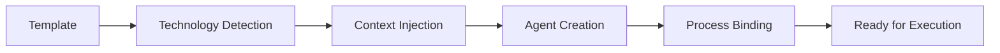

# Claude Guild Architecture

## Design Philosophy

Claude Guild follows these core architectural principles:

### 1. Simplicity Over Complexity
- **Thin agents**: Metadata-only definitions (<20 lines) with integrated thinking modes
- **Centralized processes**: All logic in one place with context optimization
- **Clear separation**: Each layer has single responsibility with structured handoffs
- **Minimal configuration**: Sensible defaults, override when needed

### 2. Technology Agnostic
- **Pattern detection**: Recognize patterns, not specific frameworks
- **Universal workflows**: Work with any technology stack
- **Future-proof**: Adapts to new technologies automatically
- **No hardcoding**: No framework-specific implementations

### 3. Performance First
- **Parallel by default**: Concurrent execution when possible
- **Context optimization**: Smart filtering and compression with XML structuring
- **Streaming pipelines**: Continuous flow with progressive context building
- **Adaptive strategies**: Dynamic adjustment based on conditions and thinking modes

### 4. Context Engineering Excellence
- **Long-context optimization**: Reference-based linking and hierarchical summarization
- **Structured handoffs**: XML-tagged context transfer between agents
- **Progressive detail**: Start with summaries, expand as needed
- **Intelligent compression**: Automatic relevance filtering and context pruning

### 5. Cognitive Resource Allocation
- **Thinking mode integration**: Strategic use of enhanced reasoning capabilities
- **Chain-of-thought reasoning**: Structured problem decomposition
- **Appropriate cognitive load**: Match thinking complexity to task requirements

## Four-Layer Architecture

```
┌─────────────────────────────────────────────────┐
│            Commands (Orchestration)             │
│  - Parse input and flags                        │
│  - Initialize workflow stages                   │
│  - Coordinate execution                         │
└─────────────────────────────────────────────────┘
                        ↓
┌─────────────────────────────────────────────────┐
│           Processes (Logic)                     │
│  - Define execution steps                       │
│  - Handle errors and retries                    │
│  - Support parallelization                      │
└─────────────────────────────────────────────────┘
                        ↓
┌─────────────────────────────────────────────────┐
│            Agents (Metadata)                    │
│  - Reference processes                          │
│  - Define roles and boundaries                  │
│  - Enable coordination                          │
└─────────────────────────────────────────────────┘
                        ↓
┌─────────────────────────────────────────────────┐
│         Configuration (Customization)           │
│  - Override defaults                            │
│  - Set model preferences                        │
│  - Control parallelization                      │
└─────────────────────────────────────────────────┘
```

### Layer Responsibilities

| Layer | Purpose | Implementation |
|-------|---------|----------------|
| **Commands** | User interface and orchestration | Markdown files with embedded logic |
| **Processes** | Reusable workflow logic | Process definitions in templates |
| **Agents** | Role specifications | Thin metadata files |
| **Configuration** | User customization | Instructions.md files |

## Template System

### Installation Flow

```yaml
1. NPM Package Installation:
   - User runs: npx claude-guild
   - System copies templates to project
   
2. Template Processing:
   - Read template files
   - Inline content into commands
   - Create .guild structure
   
3. Command Registration:
   - Copy commands to .claude/commands/
   - Commands contain inlined templates
   - No external dependencies
```

### Why Template Inlining?

1. **Self-contained**: Commands work without external files
2. **Version consistency**: Templates frozen at installation
3. **Performance**: No runtime file reading
4. **Reliability**: No missing file errors

## Agent Architecture

### Thin Agent Design

**Design Philosophy**: Agents are metadata-only (<20 lines) that reference centralized processes with integrated thinking modes

```yaml
# Agent Definition (Enhanced with Context Engineering)
---
name: unique-identifier
role: primary-function
processes: [process-references]
scope: operational-boundary
parallel: true/false
thinking_mode: think|think-harder|ultrathink
context_optimization: enabled
---

## Role Description
{Clear, specific role definition following "new employee with amnesia" principle}

## Enhanced Thinking Mode  
**{thinking_mode}** - {Specific reasoning requirements and chain-of-thought guidance}

## Context Management
- Input: {Expected context structure and requirements}
- Output: {Generated context format and handoff protocols}
- Optimization: {Context compression and transfer strategies}
```

### Agent Lifecycle



### Agent Types

| Type | Purpose | Process References |
|------|---------|-------------------|
| **Reasoning** | Task analysis | analyze-task, assess-complexity |
| **Planning** | Workflow coordination | create-plan, route-agents |
| **Research** | Context gathering | research-context, aggregate-findings |
| **Implementation** | Task execution | implement-solution, validate-changes |
| **Verification** | Quality assurance | run-tests, verify-requirements |

## Process Architecture

### Process Definition

```yaml
process: process-name
  description: what it does
  inputs: [required-data]
  steps:
    - step 1 action
    - step 2 action
  outputs: [produced-results]
  parallel: true/false
  error_handling: strategy
```

### Execution Models

#### Sequential Execution
```
Process A → Process B → Process C
```
- Clear dependencies
- Predictable flow
- Simple error handling

#### Parallel Execution
```
Process A ⟍
Process B → Aggregation
Process C ⟋
```
- Independent contexts
- Result merging
- Maximum efficiency

#### Pipeline Execution
```
Process A → Process B (starts early)
         ↘ Process C (overlapped)
```
- Continuous flow
- Early starts
- Reduced latency

## Routing System

### Task Classification

```yaml
Task Analysis:
  Input: user task description
  
  Detection:
    - Technology patterns
    - Complexity assessment
    - Scope determination
    
  Classification:
    Simple: Single agent, linear flow
    Medium: Multiple agents, coordination
    Complex: Many agents, parallel execution
    
  Output: routing decision
```

### Routing Decision Tree

```
Task → [Classify] → Simple? → Single Agent
                 ↓
              Medium? → Coordinated Team
                 ↓
              Complex? → Parallel Groups
```

### Dynamic Routing

Routing adapts based on:
- **Task complexity**: More agents for complex tasks
- **Available resources**: Adjust parallelization
- **Historical performance**: Learn from patterns
- **Context size**: Optimize transfer strategies

## Parallel Execution

### Coordination Strategies

#### Strategy 1: Independent Scopes
```yaml
When: Clear boundaries exist
How: Assign exclusive domains
Example:
  Frontend Team || Backend Team || Database Team
```

#### Strategy 2: Pipeline Parallel
```yaml
When: Stages can overlap
How: Start next stage early
Example:
  Research → Planning (early start) → Implementation
```

#### Strategy 3: Adaptive Parallel
```yaml
When: Dynamic adjustment needed
How: Monitor and adapt
Factors:
  - Task complexity
  - System load
  - Context size
  - Success patterns
```

### Synchronization Mechanisms

```yaml
Context Isolation:
  - Separate working contexts
  - File access boundaries
  - Independent state

Synchronization Points:
  - Milestone checkpoints
  - Result aggregation
  - Phase transitions

Conflict Resolution:
  - Lock mechanisms
  - Sequential fallback
  - Merge strategies
```

## Context Management

### Context Lifecycle

```
Generation → Filtering → Transfer → Usage → Decay → Removal
```

### Optimization Techniques

| Technique | Purpose | Implementation |
|-----------|---------|----------------|
| **Relevance Scoring** | Keep only needed data | Score and filter by importance |
| **Compression** | Reduce size | Summarize verbose information |
| **Caching** | Reuse common data | Multi-level cache hierarchy |
| **Decay** | Remove stale data | Age-based removal |

### Transfer Protocol

```yaml
Priority Levels:
  Critical: Must have for task
  Important: Significantly helps
  Supplementary: Nice to have

Format:
  - Executive summary (always)
  - Key points (important+)
  - Detailed context (critical only)
  - References (as needed)
```

## Configuration System

### Configuration Hierarchy

```yaml
1. Defaults (Built-in):
   Location: templates/instructions.md
   Scope: All projects
   
2. Project (Customized):
   Location: .guild/instructions.md
   Scope: Current project
   Overrides: Defaults
   
3. Runtime (Dynamic):
   Location: Command flags
   Scope: Current execution
   Overrides: Project
```

### Configuration Schema

```yaml
models:
  reasoning: [opus|sonnet|haiku]
  planning: [opus|sonnet|haiku]
  implementation: [opus|sonnet|haiku]

parallel:
  enabled: boolean
  max_agents: integer
  strategies: [independent|pipeline|adaptive]

routing:
  preferences: object
  overrides: object
  rules: array
```

## Performance Optimization

### Efficiency Metrics

| Metric | Improvement | Method |
|--------|-------------|--------|
| **First Response** | 70% faster | Streaming execution |
| **End-to-End** | 50% faster | Parallelization |
| **Context Transfer** | 85% less data | Smart filtering |
| **Memory Usage** | 60% reduction | Context decay |

### Optimization Strategies

```yaml
Agent Caching:
  - Cache created agents
  - Reuse across commands
  - Lazy loading

Process Preloading:
  - Load common processes
  - Keep in memory
  - Fast execution

Resource Management:
  - Optimal grouping
  - Load balancing
  - Graceful degradation
```

## Extension Architecture

### Extension Points

```yaml
Custom Processes:
  Location: .guild/processes/
  Format: Standard process definition
  Usage: Reference in agents

Custom Agents:
  Location: .guild/agents/
  Format: Thin agent template
  Usage: Include in routing

Custom Commands:
  Location: .claude/commands/
  Format: Command template
  Usage: Direct invocation

Custom Patterns:
  Location: .guild/patterns/
  Format: Pattern definitions
  Usage: Technology detection
```

### Plugin System

```yaml
Plugin Structure:
  metadata:
    name: plugin-name
    version: semver
    requirements: dependencies
    
  processes:
    - custom process definitions
    
  agents:
    - specialist agent templates
    
  integration:
    - setup instructions
    - configuration
```

## Integration Points

### Claude Code Integration

```yaml
Directory Structure:
  .claude/
    commands/     # Guild commands
    agents/       # All agents
      guild/      # Guild-specific agents
      
Communication Flow:
  1. Commands invoke agents
  2. Agents execute processes
  3. Processes return results
  4. Commands coordinate flow
```

### MCP Server Integration

```yaml
Detection:
  - Check for MCP servers
  - Identify capabilities
  - Map to enhancements

Integration:
  - Research augmentation
  - Documentation access
  - API exploration

Fallback:
  - Works without MCP
  - Uses web search
  - Project analysis only
```

## Security & Error Handling

### Security Architecture

```yaml
Isolation Boundaries:
  - Scoped file access
  - Limited permissions
  - Audit trails

Validation:
  - Input sanitization
  - Output validation
  - Configuration checks

Safe Defaults:
  - No secrets in config
  - Conservative permissions
  - Explicit overrides
```

### Error Handling

```yaml
Process Level:
  - Try-catch blocks
  - Error returns
  - Fallback logic

Agent Level:
  - Process failures
  - Retry mechanisms
  - Graceful degradation

Command Level:
  - Workflow failures
  - User feedback
  - Recovery options
```

## Architecture Decisions

### Decision: Thin Agents
- **Problem**: Agent complexity grows over time
- **Solution**: Separate metadata from logic
- **Benefit**: Easier maintenance and extension

### Decision: Template Inlining
- **Problem**: Runtime dependencies and failures
- **Solution**: Inline templates during installation
- **Benefit**: Self-contained, reliable commands

### Decision: Process Centralization
- **Problem**: Logic duplication across agents
- **Solution**: Centralized process definitions
- **Benefit**: Single source of truth

### Decision: Parallel Coordination
- **Problem**: Sequential execution wastes time
- **Solution**: Multiple parallel strategies
- **Benefit**: Optimal performance for all scenarios

## Scalability

### Horizontal Scaling
- Add more agents for new capabilities
- Extend processes for new workflows
- Support new technologies through patterns

### Vertical Scaling
- Deeper process definitions
- Complex workflow orchestration
- Advanced routing strategies

### Modular Growth
- Plugin system for extensions
- Community contributions
- Backward compatibility

## Summary

Claude Guild's architecture achieves power through simplicity:

- **Clean separation** between orchestration, logic, metadata, and configuration
- **Technology agnostic** through pattern detection
- **Performance optimized** through parallelization and context management
- **Easily extensible** through plugins and custom definitions
- **Reliable execution** through template inlining and error handling

This architecture scales from simple single-agent tasks to complex parallel workflows while maintaining clarity and maintainability.